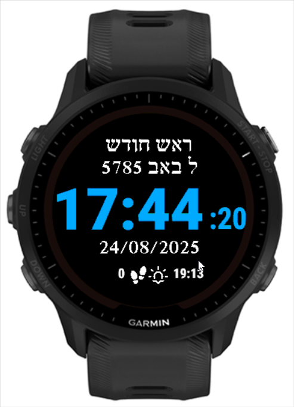

# JF Hebrew Calendar Watch Face

A comprehensive Hebrew calendar watch face for Garmin devices that displays Hebrew dates, Jewish holidays, and Shabbat/Chag information alongside standard time and fitness data.

## Features

### 🕰️ Time Display
- Current time in 24-hour format
- Customizable time color
- Optional seconds display with customizable color
- Battery level indicator with color-coded status

### 📅 Hebrew Calendar
- Hebrew date display in Hebrew text
- Jewish holiday information
- Automatic calculation based on sunset times
- Support for both current day and next Hebrew day

### 🌅 Sun Times & Location
- Sunrise and sunset calculations based on GPS location
- Next sun event display (sunrise/sunset countdown)
- Automatic GPS location detection
- Visual sun event icons

### 🚶 Activity Tracking
- Step counter with custom icon
- Customizable step counter color
- Optional display toggle

### 🕯️ Shabbat & Holiday Mode
- Automatic Shabbat detection (Friday evening to Saturday evening)
- Jewish holiday (Chag) detection
- "שבת שלום" (Shabbat Shalom) display during Shabbat
- "חג שמח" (Chag Sameach) display during holidays
- Automatic disabling of step counter and sun events during Shabbat/Chag
- Support for both standard and Rabbenu Tam times (36 or 72 minutes after sunset)

### 🎨 Customization
- Multiple color options for all display elements:
  - Time color
  - Seconds color
  - Hebrew date color
  - Gregorian date color
  - Sun event color
  - Steps color
- Toggle options for all display elements
- Shabbat mode enable/disable
- Rabbenu Tam time calculation option

## Compatible Devices

This watch face supports a wide range of Garmin devices including:

### Approach Series
- Approach S50, S60, S62
- Approach S70 (42mm & 47mm)

### Aviation Series (D2)
- D2 Air, D2 Air X10
- D2 Bravo, D2 Bravo Titanium
- D2 Charlie, D2 Delta, D2 Delta PX, D2 Delta S
- D2 Mach 1

### Descent Series
- Descent G1, G2
- Descent Mk1, Mk2, Mk2S
- Descent Mk3 (43mm & 51mm)

### Enduro Series
- Enduro, Enduro 3

### Epix Series
- Epix 2
- Epix 2 Pro (42mm, 47mm, 51mm)

### Fenix Series
- Fenix 3, Fenix 3 HR
- Fenix 5, Fenix 5S, Fenix 5X
- Fenix 5 Plus, Fenix 5S Plus, Fenix 5X Plus
- Fenix 6, Fenix 6S, Fenix 6X
- Fenix 6 Pro, Fenix 6S Pro, Fenix 6X Pro
- Fenix 7, Fenix 7S, Fenix 7X
- Fenix 7 Pro, Fenix 7S Pro, Fenix 7X Pro
- Fenix 8 (43mm, 47mm, 51mm)

### Forerunner Series
- Forerunner 245, 245 Music
- Forerunner 255, 255 Music, 255S, 255S Music
- Forerunner 265, 265S
- Forerunner 935, 945, 945 LTE
- Forerunner 955, 965

### MARQ Series
- MARQ Adventurer, Athlete, Aviator, Captain, Commander, Driver, Expedition, Golfer

### Quatix Series
- Quatix 5, 6, 7

### Tactix Series
- Tactix 7, Tactix Delta, Tactix Charlie

### Venu Series
- Venu, Venu Mercedes-Benz Collection, Venu Sq, Venu Sq 2, Venu Sq 2 Music Edition
- Venu 2, Venu 2 Plus, Venu 2S, Venu 3, Venu 3S

### Vivoactive Series
- Vivoactive 3, Vivoactive 3 Mercedes-Benz Collection, Vivoactive 3 Music
- Vivoactive 4, Vivoactive 4S, Vivoactive 5

## Installation

1. Download the latest release from the [Garmin Connect IQ Store](https://apps.garmin.com/) (search for "JF Hebrew Calendar")
2. Install via Garmin Connect Mobile app or Garmin Express
3. Set as your watch face from the watch settings

## Configuration

Access the watch face settings through:
- Garmin Connect Mobile app → Device → Watch Faces → JF Hebrew Calendar → Settings
- Or directly on compatible devices with touchscreen

### Available Settings

- **Show Battery Level**: Toggle battery indicator
- **Show Time**: Toggle time display
- **Time Color**: Choose from 7 color options
- **Time Font**: Select Number Medium, Number Hot, or Number Thai Hot fonts
- **Show Seconds**: Toggle seconds display
- **Seconds Color**: Choose from 7 color options
- **Hebrew Date Color**: Choose from 7 color options
- **Show Gregorian Date**: Toggle DD/MM/YYYY date display
- **Gregorian Date Color**: Choose from 7 color options
- **Show Steps**: Toggle step counter
- **Steps Color**: Choose from 7 color options
- **Show Sun Event**: Toggle sunrise/sunset times
- **Sun Event Color**: Choose from 7 color options
- **Shabbat Mode**: Enable automatic Shabbat/Chag behavior
- **Rabbenu Tam**: Use 72 minutes after sunset instead of 36 minutes

## Technical Details

### Hebrew Calendar Calculations
- Accurate Hebrew date calculations
- Proper handling of leap years (7 in every 19-year cycle)
- Jewish holiday detection algorithm
- Sunset-based day transitions

### Location & Sun Times
- GPS-based location detection
- Astronomical calculations for sunrise/sunset
- Fallback to Jerusalem coordinates (31.77758°N, 35.235786°E) when GPS unavailable
- Automatic daily recalculation

### Shabbat/Holiday Logic
- Friday sunset minus 18 minutes for candle lighting
- Saturday evening plus 36 minutes (standard) or 72 minutes (Rabbenu Tam) for Havdalah
- Automatic detection of Jewish holidays
- UI simplification during Shabbat/holidays

## Development

### Prerequisites
- [Garmin Connect IQ SDK](https://developer.garmin.com/connect-iq/sdk/)
- Visual Studio Code with Monkey C extension

### Building
1. Clone this repository
2. Open in VS Code
3. Use "Monkey C: Build" command
4. Deploy to device or simulator

### Project Structure
```
├── source/              # Monkey C source code
│   ├── JF-HebrewCalendarApp.mc     # Main application
│   ├── JF-HebrewCalendarView.mc    # Watch face view
│   ├── HebrewCalendar.mc           # Hebrew calendar calculations
│   ├── HebrewCalendarTest.mc       # Test utilities
│   └── SunCalc.mc                  # Sunrise/sunset calculations
├── resources/           # Application resources
│   ├── drawables/       # Icons and graphics
│   ├── fonts/          # Custom fonts
│   ├── layouts/        # UI layouts
│   ├── settings/       # Configuration files
│   └── strings/        # Localized strings
└── manifest.xml        # App manifest
```

## Screenshots


*Example of the watch face displaying Hebrew date, time, and sun event information*

## Contributing

Contributions are welcome! Please feel free to submit issues or pull requests.

### Areas for Contribution
- Additional Jewish calendar features
- Localization to other languages
- UI improvements
- Bug fixes and optimizations

## License

This project is open source. Please see the license file for details.

## Credits

Developed by JF for the Jewish community using Garmin devices.

Special thanks to the Garmin Connect IQ platform for making custom watch faces possible.

---

## Support

For support, bug reports, or feature requests, please open an issue on GitHub.

*May this watch face help you stay connected to Jewish time and tradition throughout your day!*
